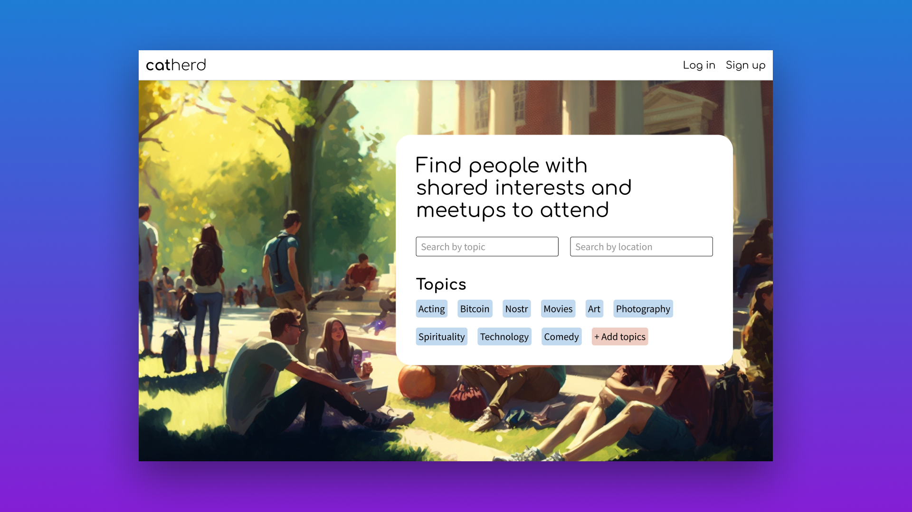

# Cat Herd

A nostr client for scheduling and finding in-person meetups



Cat Herd utilizes custom event kinds to facilitate creating meetup groups, scheduling meetup events for these groups, joining groups, and RSVPing for groups. You can find our [relay implementation here](https://github.com/terminus-btc/nostr-meetup-relay) which is a proof of concept for how these new event kinds could work.

- [Project Specs](https://docs.google.com/document/d/1ZzTEw7VY2lM3Ej7v5QMuFmtgnEl4lKYvds8D3I-6yUk/edit?usp=sharing)
- [Figma File](https://www.figma.com/file/KYsv36ixjrCDUVjFcaYhuU/Nostr-Meetup?node-id=0%3A1&t=Cg80Er1iyBbrjM7U-1)
- [Bolt.Fun Page](https://makers.bolt.fun/project/meetr)
- [Our Custom Nostr Relay](https://github.com/terminus-btc/nostr-meetup-relay)

## Dev

Run the dev server:

```bash
yarn dev
```
